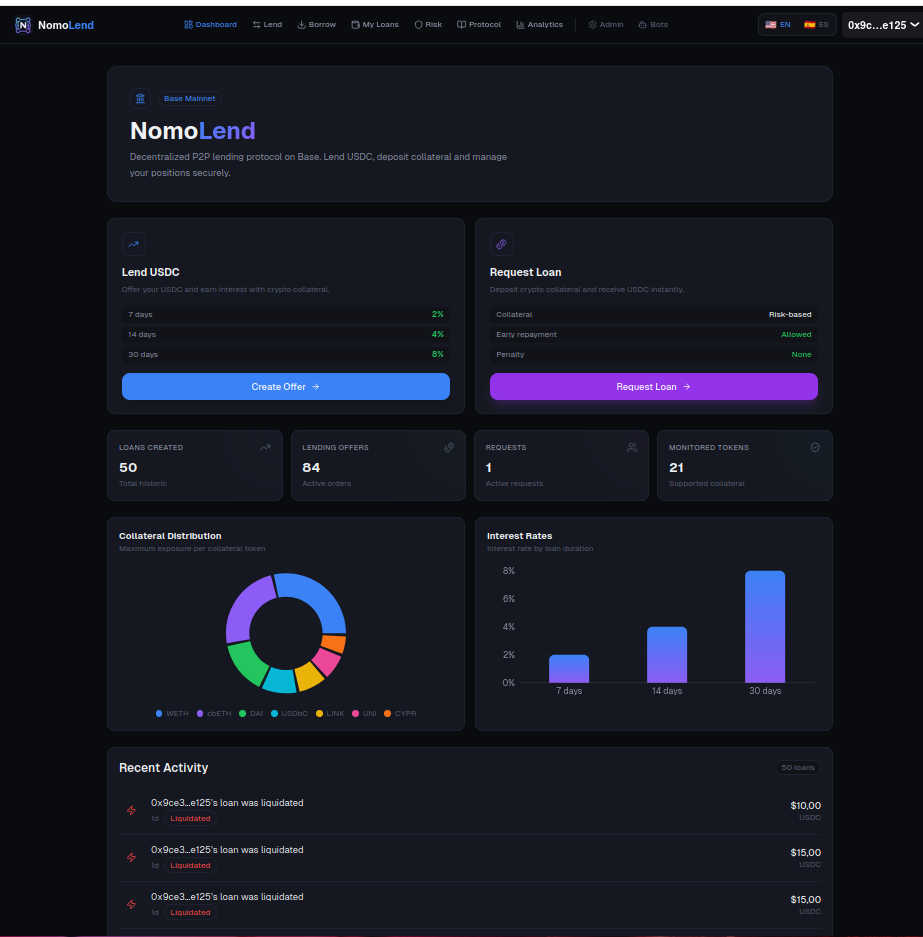
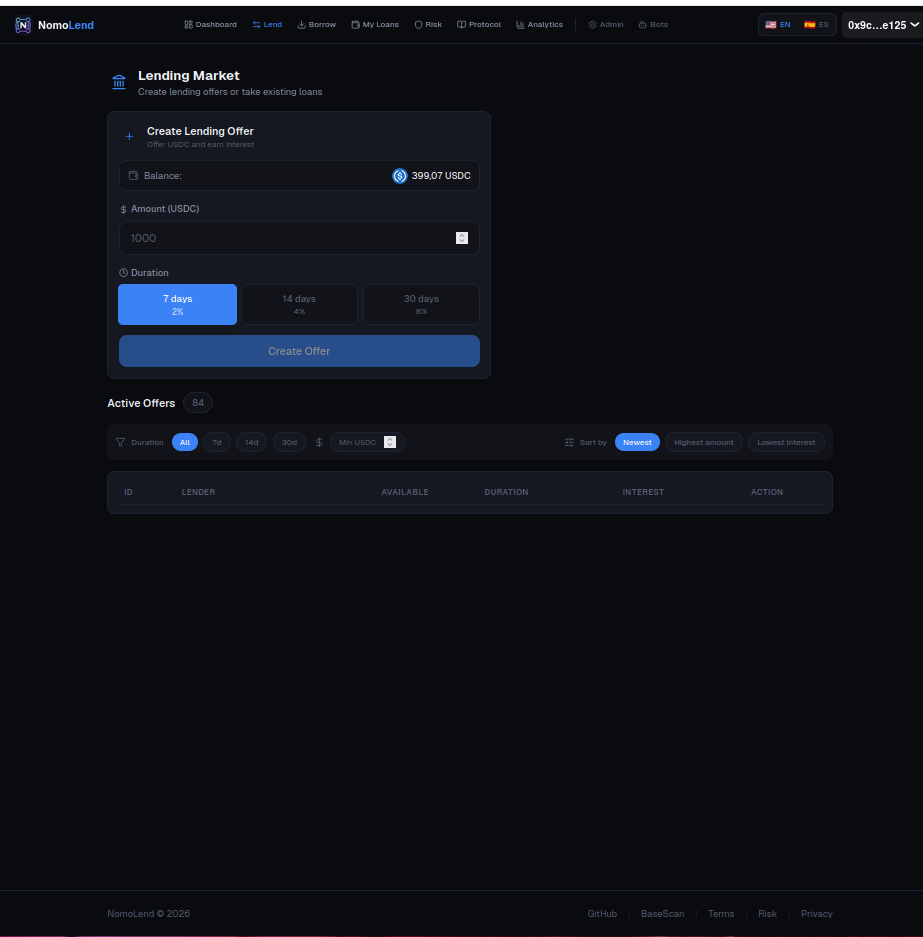
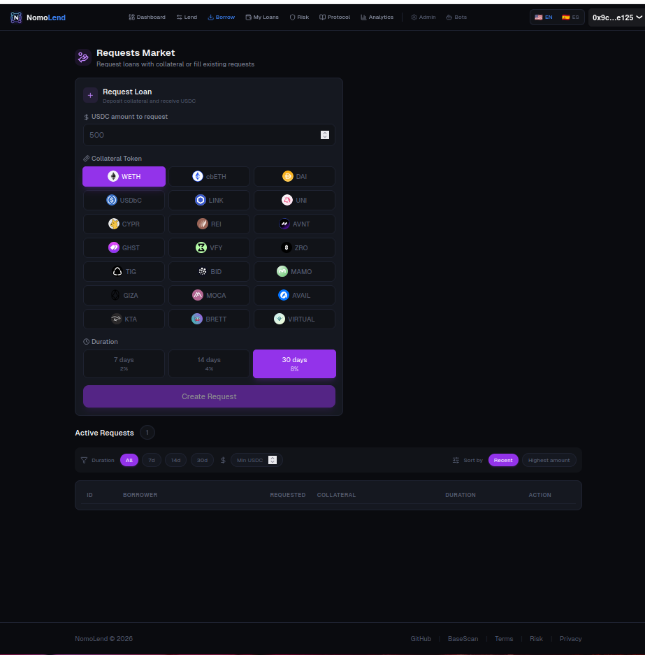
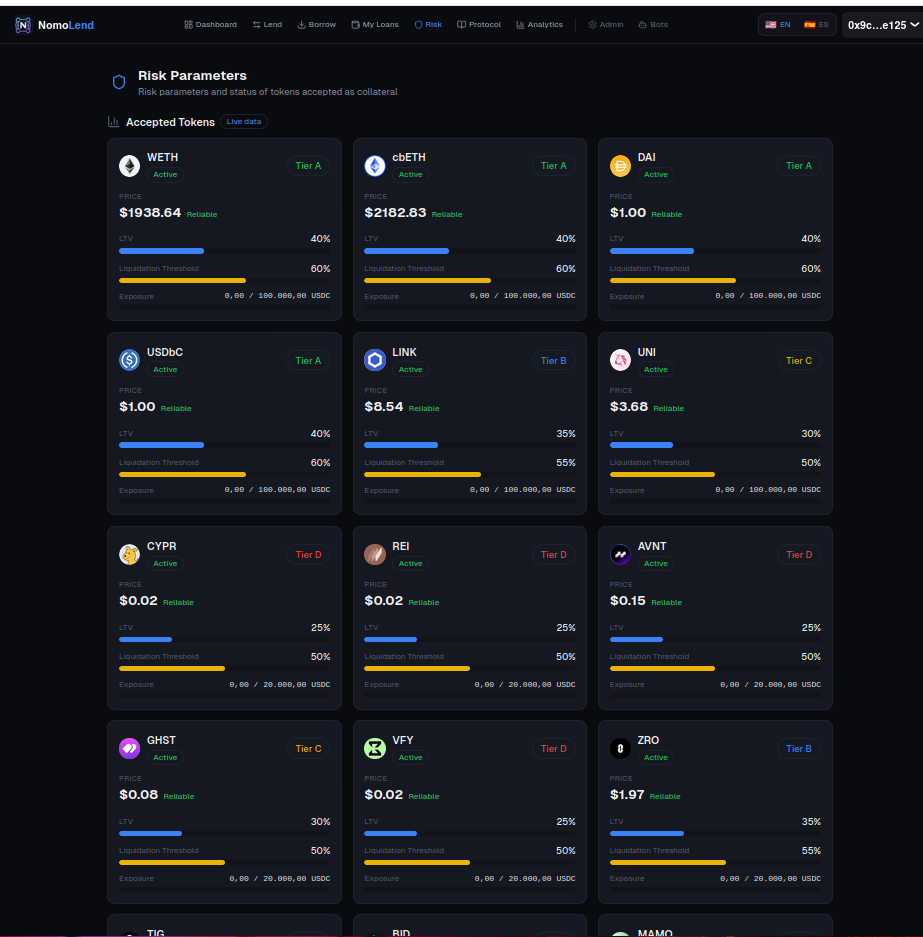

# NomoLend — Decentralized P2P Lending Protocol on Base


> Decentralized P2P lending protocol built on Base. Lenders earn fixed interest. Borrowers deposit collateral. No pools. No intermediaries. Each loan is isolated.

| | |
|---|---|
| **Website** | [https://nomolend.com](https://nomolend.com) |
| **Docs** | [Documentation](https://github.com/alexmejia1822/NomoLend/tree/main/docs) |
| **Contracts** | Base Mainnet — [View on BaseScan](https://basescan.org/address/0x356e137F8F93716e1d92F66F9e2d4866C586d9cf) |

---

## Live Protocol

| | |
|---|---|
| **Network** | Base Mainnet (Chain ID: 8453) |
| **Frontend** | [https://nomolend.com](https://nomolend.com) |
| **Status** | Live |
| **Version** | v1.1 |

### Deployed Contracts

| Contract | Address | BaseScan |
|----------|---------|----------|
| ProtocolConfig | `0x0a41e67c838192944F0F7FA93943b48c517af20e` | [View](https://basescan.org/address/0x0a41e67c838192944F0F7FA93943b48c517af20e) |
| TokenValidator | `0xe0CA16261405CA12F156E2F3A0B309d9587B9e4D` | [View](https://basescan.org/address/0xe0CA16261405CA12F156E2F3A0B309d9587B9e4D) |
| PriceOracle | `0xc8Fb5BCaC3501E060e6AFb89cd0723BCC98f1e08` | [View](https://basescan.org/address/0xc8Fb5BCaC3501E060e6AFb89cd0723BCC98f1e08) |
| RiskEngine | `0xc5E0fDDB27bB10Efb341654dAbeA55d3Cc09870F` | [View](https://basescan.org/address/0xc5E0fDDB27bB10Efb341654dAbeA55d3Cc09870F) |
| CollateralManager | `0x180dcc27C5923c6FEeD4Fd4f210c6F1fE0A812c5` | [View](https://basescan.org/address/0x180dcc27C5923c6FEeD4Fd4f210c6F1fE0A812c5) |
| LiquidationEngine | `0x6e892AEadda28E630bbe84e469fdA25f1B1B4820` | [View](https://basescan.org/address/0x6e892AEadda28E630bbe84e469fdA25f1B1B4820) |
| OrderBook | `0x400Abe15172CE78E51c33aE1b91F673004dB2315` | [View](https://basescan.org/address/0x400Abe15172CE78E51c33aE1b91F673004dB2315) |
| LoanManager | `0x356e137F8F93716e1d92F66F9e2d4866C586d9cf` | [View](https://basescan.org/address/0x356e137F8F93716e1d92F66F9e2d4866C586d9cf) |
| ReserveFund | `0xDD4a6B527598B31dBcC760B58811278ceF9A3A13` | [View](https://basescan.org/address/0xDD4a6B527598B31dBcC760B58811278ceF9A3A13) |
| RiskGuardian | `0xb9b90eE151D53327c1C42a268Eb974A08f1E07Ef` | [View](https://basescan.org/address/0xb9b90eE151D53327c1C42a268Eb974A08f1E07Ef) |
| UniswapV3Adapter | `0x43215Df48f040CD5A76ed2a19b9e27E62308b1DC` | [View](https://basescan.org/address/0x43215Df48f040CD5A76ed2a19b9e27E62308b1DC) |
| AerodromeAdapter | `0x06578CB045e2c588f9b204416d5dbf5e689A2639` | [View](https://basescan.org/address/0x06578CB045e2c588f9b204416d5dbf5e689A2639) |
| AerodromeCLAdapter | `0x51e7a5E748fFd0889F14f5fAd605441900d0DA27` | [View](https://basescan.org/address/0x51e7a5E748fFd0889F14f5fAd605441900d0DA27) |

Full deployment data: [`deployments/base-mainnet.json`](./deployments/base-mainnet.json)

---

## Features

- **P2P Lending Marketplace** — Lenders create USDC lending orders, borrowers choose which to take. No shared pools.
- **Borrow Requests** — Borrowers can post collateral upfront and request USDC. Lenders fill the requests.
- **Partial Fills** — Both lending orders and borrow requests support partial fills across multiple counterparties.
- **21 Collateral Tokens** — Blue-chips (WETH, cbETH), stablecoins (DAI, USDbC), DeFi tokens (LINK, UNI, ZRO), and emerging assets (BRETT, VIRTUAL, MOCA, etc.).
- **Automated Liquidations** — Keeper bots monitor loan health 24/7 and liquidate via DEX swaps (Uniswap V3 + Aerodrome fallback).
- **Dynamic Risk Engine** — Per-token LTV, liquidation thresholds, exposure limits, circuit breakers, and surge detection.
- **Dual Oracle System** — Chainlink price feeds (primary) + TWAP via CoinGecko (fallback) with deviation checks and staleness protection.
- **Bracket Interest Rates** — Fixed, predictable returns: 2% (7d), 4% (14d), 8% (30d). No variable rates.
- **Exposure Limits** — Per-token caps prevent concentration risk (default: 100K USDC per token).
- **Reserve Fund** — 20% of platform fees accumulate in a reserve fund to cover bad debt from failed liquidations.
- **24/7 Monitoring Bots** — 4 independent PM2 processes with RPC failover, auto-restart, health endpoint, and Telegram alerts.
- **Multisig Governance** — 2-of-3 Gnosis Safe controls all admin roles. Deployer has zero privileges. Separate bot wallet with minimal roles.
- **Router Timelock** — 24-hour delay for DEX router changes, preventing instant redirect attacks.
- **Multi-Language UI** — Frontend supports English and Spanish (i18n).
- **Analytics Dashboard** — Real-time protocol metrics, token stats, and loan analytics.
- **Admin Panel** — Protected admin interface for protocol management and bot monitoring.

---

## Architecture Overview

NomoLend uses a modular architecture with **10 core contracts + 4 DEX adapters**, each with a single responsibility:

```
                    ProtocolConfig
                    (routers, USDC, treasury, timelock)
                          |
    TokenValidator -- PriceOracle ------- RiskEngine
    (whitelist/       (Chainlink + TWAP    (LTV, thresholds,
     blacklist)        deviation check)     circuit breaker,
                          |                 surge detection)
                          |
              CollateralManager --------- OrderBook
              (lock/release,              (lending orders,
               fee-on-transfer             borrow requests,
               protection)                 partial fills)
                          |
                     LoanManager
                     (create, repay, liquidate,
                      interest calculation,
                      grace period)
                          |
              LiquidationEngine --------- ReserveFund
              (primary + fallback          (bad debt cover,
               DEX routing,                governance-gated)
               slippage protection)
                          |
          +-------+-------+-------+
          |       |       |       |
     UniswapV3  Aerodrome  AerodromeCL  AerodromeMultihop
     Adapter    Adapter    Adapter      Adapter
```

**RiskGuardian** operates independently as an emergency-only contract with limited powers (pause, reduce LTV, disable tokens).

---

## Interface Preview

<table>
  <tr>
    <td align="center"><strong>Dashboard</strong></td>
    <td align="center"><strong>Lending Market</strong></td>
  </tr>
  <tr>
    <td></td>
    <td></td>
  </tr>
  <tr>
    <td align="center"><strong>Borrow Requests (21 tokens)</strong></td>
    <td align="center"><strong>Risk Parameters</strong></td>
  </tr>
  <tr>
    <td></td>
    <td></td>
  </tr>
</table>

---

## How It Works

```
1. Lender deposits USDC          2. Borrower takes loan
   into OrderBook                    deposits collateral
        |                                |
        v                                v
   [Lending Order]  ──────────>   [LoanManager]
                                       |
                          +────────────+────────────+
                          |            |            |
                     RiskEngine   PriceOracle  CollateralManager
                     (validate)   (price check) (lock collateral)
                          |
                          v
                    [Loan Active]
                          |
              +-----------+-----------+
              |                       |
        [Borrower Repays]      [Liquidation]
              |                       |
         Principal +            Keeper bot detects
         Interest                unhealthy loan
              |                       |
         Collateral            LiquidationEngine
         released               swaps on DEX
              |                       |
         Lender gets            Lender gets
         principal +            repayment from
         net interest           swap proceeds
```

---

## Interest Rate Model

| Duration | Interest Rate |
|----------|---------------|
| 7 days   | 2%            |
| 14 days  | 4%            |
| 30 days  | 8%            |

Platform fee: **10%** of interest earned (80% treasury, 20% reserve fund).

---

## Collateral Tokens (21)

### Risk Tier A — Blue-chip (LTV 40% / Liquidation 60%)

| Token | Address | Oracle |
|-------|---------|--------|
| WETH | `0x4200000000000000000000000000000000000006` | Chainlink + TWAP |
| cbETH | `0x2Ae3F1Ec7F1F5012CFEab0185bfc7aa3cf0DEc22` | Chainlink + TWAP |
| DAI | `0x50c5725949A6F0c72E6C4a641F24049A917DB0Cb` | Chainlink + TWAP |
| USDbC | `0xd9aAEc86B65D86f6A7B5B1b0c42FFA531710b6CA` | Chainlink + TWAP |

### Risk Tier B — Established (LTV 35% / Liquidation 55%)

| Token | Address | Oracle |
|-------|---------|--------|
| LINK | `0x88Fb150BDc53A65fe94Dea0c9BA0a6dAf8C6e196` | Chainlink + TWAP |
| ZRO | `0x6985884c4392d348587b19cb9eaaf157f13271cd` | TWAP |
| MOCA | `0x2b11834ed1feaed4b4b3a86a6f571315e25a884d` | TWAP |

### Risk Tier C — Moderate (LTV 30% / Liquidation 50%)

| Token | Address | Oracle |
|-------|---------|--------|
| UNI | `0xc3De830EA07524a0761646a6a4e4be0e114a3C83` | TWAP |
| VIRTUAL | `0x0b3e328455c4059eeb9e3f84b5543f74e24e7e1b` | TWAP |
| GHST | `0xcd2f22236dd9dfe2356d7c543161d4d260fd9bcb` | TWAP |
| AVAIL | `0xd89d90d26b48940fa8f58385fe84625d468e057a` | TWAP |
| TIG | `0x0c03ce270b4826ec62e7dd007f0b716068639f7b` | TWAP |

### Risk Tier D — Emerging (LTV 25% / Liquidation 50%)

| Token | Address | Oracle |
|-------|---------|--------|
| CYPR | `0xD262A4c7108C8139b2B189758e8D17c3DFC91a38` | TWAP |
| REI | `0x6b2504a03ca4d43d0d73776f6ad46dab2f2a4cfd` | TWAP |
| AVNT | `0x696f9436b67233384889472cd7cd58a6fb5df4f1` | TWAP |
| VFY | `0xa749de6c28262b7ffbc5de27dc845dd7ecd2b358` | TWAP |
| BID | `0xa1832f7f4e534ae557f9b5ab76de54b1873e498b` | TWAP |
| MAMO | `0x7300b37dfdfab110d83290a29dfb31b1740219fe` | TWAP |
| GIZA | `0x590830dfdf9a3f68afcdde2694773debdf267774` | TWAP |
| KTA | `0xc0634090f2fe6c6d75e61be2b949464abb498973` | TWAP |
| BRETT | `0x532f27101965dd16442e59d40670faf5ebb142e4` | TWAP |

---

## Project Status

| | |
|---|---|
| **Version** | v1.1 |
| **Network** | Base Mainnet |
| **Status** | Live |
| **Contracts** | 10 core + 4 DEX adapters |
| **Governance** | 2-of-3 Gnosis Safe multisig |
| **Tests** | 84 passing (15 unit + 45 fuzz + 24 integration) |
| **Collateral Tokens** | 21 (across 4 risk tiers) |
| **Keeper Bots** | 4 independent PM2 processes |
| **Languages** | English, Spanish |

---

## Test Suite

NomoLend has **84 test scenarios** across three layers:

```
84 Test Scenarios
├── Unit Tests (15)              Hardhat — contract logic, math, access control
├── Fuzz & Invariant Tests (45)  Foundry — randomized property testing (1,000 runs each)
└── Integration Tests (24)       Base Mainnet — real DEX, real oracle, real gas
```

```bash
# Run all tests
npx hardhat test              # 15 unit tests
forge test -vv                # 45 fuzz tests (1,000 runs each)
npm run test-panel            # 24 integration tests (web panel at :4000)
```

**Fuzz testing** covers interest calculation invariants, health factor properties, liquidation proceeds conservation, and risk parameter boundaries. **Integration tests** run on Base Mainnet and cover extreme slippage, TWAP manipulation, cascading liquidations, death spiral (95% crash), and zero-liquidity scenarios.

See [Testing Documentation](./docs/testing.md) for the complete test catalog and coverage matrix.

---

## Security & Audit Status

NomoLend has completed a **comprehensive internal security review** covering all 10 core contracts and 4 DEX adapters. The review identified and resolved 15+ findings across critical, medium, and low severity categories.

**External audit is planned for a future milestone.**

| Layer | Mechanism | Description |
|-------|-----------|-------------|
| **Access Control** | OpenZeppelin AccessControl + 2-of-3 Multisig | All admin roles on Gnosis Safe. Deployer has zero privileges. Bot wallet has minimal roles. |
| **Reentrancy** | ReentrancyGuard | All token-handling functions protected against reentrancy attacks |
| **Oracle Safety** | Chainlink + TWAP + Deviation Checks | Dual oracle with 10% max change per update, 5-min cooldown, staleness threshold |
| **Circuit Breakers** | Automatic Token Pausing | 30%+ price drop auto-pauses token; borrowing surge detection (50K USDC/hour) |
| **Exposure Limits** | Per-Token Caps | Maximum 100K USDC exposure per collateral token (configurable) |
| **Liquidation Safety** | Slippage Protection + Router Fallback | 5% max slippage on DEX swaps; automatic fallback from Uniswap V3 to Aerodrome |
| **Emergency Controls** | RiskGuardian Contract | Limited emergency powers (pause, reduce LTV, disable tokens) on separate multisig |
| **Timelock** | 24-Hour Router Delay | DEX router changes require 24-hour waiting period to prevent instant redirect attacks |

See [SECURITY.md](./SECURITY.md) for the full security model and [security documentation](./docs/security.md) for the access control matrix, threat mitigations, and review findings.

---

## Repository Structure

```
NomoLend/
  contracts/              # Solidity smart contracts
    interfaces/           #   Contract interfaces (INomoLend, IPriceOracle, etc.)
    libraries/            #   InterestCalculator library
    mocks/                #   Test mocks (MockERC20, MockChainlinkFeed, MockSwapRouter)
    adapters/             #   DEX adapters (UniswapV3, Aerodrome, AerodromeCL, AerodromeMultihop)
  tests/                  # Hardhat unit tests (15 tests)
  test/foundry/           # Foundry fuzz & invariant tests (45 tests)
  bots/                   # Keeper bots (PM2 ecosystem, 4 independent processes)
  frontend/               # Next.js 14 + TypeScript + Tailwind CSS + wagmi 2 + RainbowKit 2
    app/                  #   App Router (13 routes: dashboard, lend, borrow, my-loans, risk, analytics, protocol, admin)
    i18n/                 #   Internationalization (English + Spanish)
  scripts/                # Deploy, configure, migration, and test scripts
  deployments/            # Deployed contract addresses per network
  docs/                   # Technical documentation (20 documents)
```

---

## Documentation

| Document | Description |
|----------|-------------|
| [Protocol Overview](./docs/overview.md) | What NomoLend is, P2P lending model, competitive advantages |
| [Architecture](./docs/architecture.md) | Contract interactions, system design, data flows |
| [Contracts Reference](./docs/contracts.md) | Every contract: functions, events, roles, addresses |
| [Loan Lifecycle](./docs/loan-lifecycle.md) | Loan creation, repayment, partial fills, validations |
| [Interest Model](./docs/interest-model.md) | Bracket interest system (2%/4%/8%), fee distribution |
| [Liquidations](./docs/liquidations.md) | Health factor, DEX routing, proceeds distribution |
| [Risk Model](./docs/risk-model.md) | Risk tiers, exposure limits, circuit breakers, surge detection |
| [Oracle System](./docs/oracle-system.md) | Dual oracle (Chainlink + TWAP), manipulation protection |
| [Collateral Tokens](./docs/collateral-tokens.md) | All 21 supported tokens with tiers and parameters |
| [DEX Adapters](./docs/dex-adapters.md) | Uniswap V3 + Aerodrome adapters, slippage, fallback |
| [Keeper Bots](./docs/bots.md) | 4 bot processes: price updater, liquidation, monitor, health |
| [Keeper Infrastructure](./docs/keepers.md) | PM2, Firebase, Vercel Crons, watchdog, alerts |
| [Security](./docs/security.md) | Access control, protections, internal review findings |
| [Governance](./docs/governance.md) | Gnosis Safe multisig, roles, timelock, RiskGuardian |
| [Frontend](./docs/frontend.md) | Next.js app, pages, hooks, i18n, API routes |
| [Admin Panel](./docs/admin-panel.md) | Bot control, TWAP prices, risky loans, security |
| [Deployment](./docs/deployment.md) | Deploy steps, contract addresses, infrastructure |
| [Testing](./docs/testing.md) | 84 tests: 15 unit + 45 fuzz + 24 integration |
| [Known Risks](./docs/known-risks.md) | Risk factors and mitigations |
| [FAQ](./docs/faq.md) | Common questions about the protocol |

---

## Quick Start

### Prerequisites

- Node.js >= 18
- npm
- Foundry (for fuzz tests)

### Install & Compile

```bash
git clone https://github.com/alexmejia1822/NomoLend.git
cd NomoLend
npm install
npx hardhat compile
```

### Run Tests

```bash
# Unit tests (Hardhat)
npx hardhat test

# Fuzz & invariant tests (Foundry)
forge test -vv

# Integration tests (Base Mainnet, web panel)
npm run test-panel
```

### Run Frontend

```bash
cd frontend
npm install
cp .env.example .env.local  # Edit with your values
npm run dev                  # http://localhost:3000
```

### Run Keeper Bots (PM2 — Production)

```bash
cp .env.example .env  # Edit with your values

# Start all 4 bots as independent PM2 processes
pm2 start bots/ecosystem.config.cjs

# Monitor
pm2 status
pm2 logs

# Auto-restart on reboot
pm2 save && pm2 startup
```

---

## Tech Stack

| Layer | Technology |
|-------|-----------|
| Smart Contracts | Solidity 0.8.24, Hardhat, OpenZeppelin 5 |
| Fuzz Testing | Foundry (forge-std), 1,000 runs per test |
| Frontend | Next.js 14, TypeScript, Tailwind CSS, wagmi 2, RainbowKit 2 |
| Internationalization | i18n (English + Spanish) |
| Keeper Bots | Node.js, ethers.js v6, Firebase, Telegram/Discord alerts |
| Network | Base Mainnet (USDC as lending currency) |
| Oracles | Chainlink (primary) + TWAP via CoinGecko (fallback) |
| DEX Routing | Uniswap V3 (primary) + Aerodrome (fallback) + AerodromeCL |

---

## Governance

All protocol admin roles are controlled by a **2-of-3 Gnosis Safe multisig**. The original deployer wallet has **zero roles** — it cannot modify any contract.

| Wallet | Roles | Purpose |
|--------|-------|---------|
| **Gnosis Safe** `0x362D...DB87` | All admin roles (21 across 10 contracts) | Protocol governance |
| **Bot Wallet** `0x78cB...5E03` | PRICE_UPDATER + LIQUIDATOR only | Automated operations |
| **Deployer** `0x9ce3...3A25` | None (all revoked) | Retired |

Migration scripts: `scripts/migrate-to-multisig.js`, `scripts/safe-grant-roles.js`, `scripts/cleanup-deployer.js`

---

## Keeper Bot Infrastructure

4 independent PM2 processes ensure no single point of failure. If one bot crashes, the others continue operating.

| Process | Script | Interval | Function |
|---------|--------|----------|----------|
| `nomolend-price-updater` | `priceUpdater.js` | 5 min | CoinGecko + DEX prices -> on-chain TWAP |
| `nomolend-liquidation-bot` | `liquidationBot.js` | 2 min | Scan loans + execute liquidations |
| `nomolend-monitor-bot` | `monitorBot.js` | 2 min | Oracle/reserve/DEX/watchdog checks |
| `nomolend-health-api` | `healthServer.js` | Always | HTTP health at :4040 + Telegram reports |

**Resilience features:**
- **RPC failover**: Multi-endpoint rotation with automatic fallback (`rpcProvider.js`)
- **Auto-restart**: PM2 restarts crashed processes (max 50 restarts, 5s delay)
- **Health endpoint**: `GET /health` returns per-bot status (200 healthy, 503 degraded)
- **Telegram alerts**: Periodic health reports (30 min) + immediate degradation alerts
- **Watchdog**: Cross-bot heartbeat monitoring — alerts if any bot stops responding
- **Firebase control**: Remote ON/OFF toggle per bot from admin panel

---

## Frontend Pages

| Page | Route | Description |
|------|-------|-------------|
| Dashboard | `/` | Protocol overview, TVL, active loans, token stats |
| Lend | `/lend` | Create lending orders, view available orders |
| Borrow | `/borrow` | Browse orders, create borrow requests, deposit collateral |
| My Loans | `/my-loans` | Active loans, repayment, loan history |
| Risk | `/risk` | Risk tiers, token parameters, circuit breaker status |
| Protocol | `/protocol` | Protocol documentation and information |
| Analytics | `/analytics` | Real-time protocol metrics and charts |
| Admin | `/admin` | Protocol management (multisig only) |
| Admin Bots | `/admin/bots` | Bot monitoring and control (multisig only) |

---

## License

[MIT](./LICENSE)
